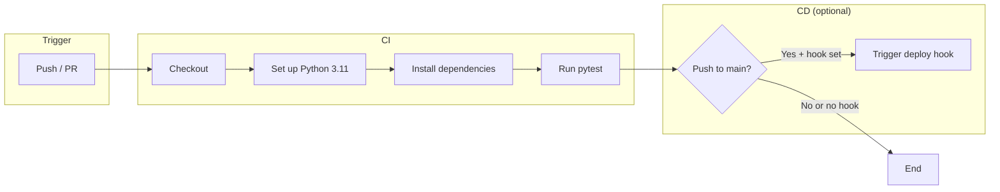

# VectixLogic Policy RAG

RAG (Retrieval-Augmented Generation) over VectixLogic policy documents for Quantic MSSE. Answers cite Policy IDs (e.g. VL-SEC-019) and use exact terminology from the corpus.

## Install

```bash
cd vectix-policy-rag
python -m venv .venv
source .venv/bin/activate   # Windows: .venv\Scripts\activate
pip install -r requirements.txt
```

## Environment

Copy the example file and add your keys:

```bash
cp .env.example .env
# Edit .env and set OPENAI_API_KEY=sk-...
```

Variables (loaded from `.env` via python-dotenv when you run the app or scripts):

| Variable | Required | Description |
|----------|----------|-------------|
| **OPENAI_API_KEY** | For real RAG | Enables real embeddings and LLM. If unset, app runs in demo mode with mocks. |
| **CHROMA_PERSIST_DIR** | No | ChromaDB persistence directory. Default: `chroma_data`. |

## Build the vector store

Run once after adding or changing policy files in `data/raw/`:

```bash
PYTHONPATH=. python scripts/build_store.py
```

## Run the app

**Streamlit UI**

```bash
streamlit run streamlit_app.py
```

**API (FastAPI)**

```bash
uvicorn api.main:app --reload
```

- **GET /health** → `{"status": "ok"}`
- **POST /chat** → body: `{"query": "..."}` → `{"answer": "...", "sources": [...], "chunks": [...]}`

## Run evaluation

```bash
PYTHONPATH=. python scripts/run_evaluation.py
```

## Tests

```bash
pip install -r requirements.txt
PYTHONPATH=. pytest tests/ -v
```

## CI/CD

GitHub Actions runs on every push and pull request: install deps, run tests, and (on push to `main`) optionally trigger deployment if a deploy hook is configured.

### Workflow overview



- **CI:** On every push and pull request, the workflow checks out the repo, sets up Python 3.11, installs from `requirements.txt`, and runs `pytest tests/ -v`.
- **CD:** On push to `main` (after tests pass), if the `RENDER_DEPLOY_HOOK` secret is set in the repo, the workflow calls that URL to trigger a deploy (e.g. Render). If the secret is not set, the deploy step is skipped and the workflow still succeeds.

To enable CD: add a **Render** deploy hook (or similar) and set it as the `RENDER_DEPLOY_HOOK` secret in the repo (**Settings → Secrets and variables → Actions**). See [.github/workflows/main.yml](.github/workflows/main.yml).

## Project layout

- **data/raw/** – Policy Markdown files
- **data/eval_20_gold.json** – 20 evaluation questions with gold answers
- **src/** – ingestion, vector_store, rag_engine, rag_app
- **scripts/build_store.py** – Build Chroma from `data/raw/`
- **scripts/run_evaluation.py** – Run RAG eval and latency
- **streamlit_app.py** – Streamlit UI
- **api/main.py** – FastAPI `/health` and `/chat`
- **docs/** – design-and-evaluation.md, ai-tooling.md, evaluation_guide.md, deployed.md
